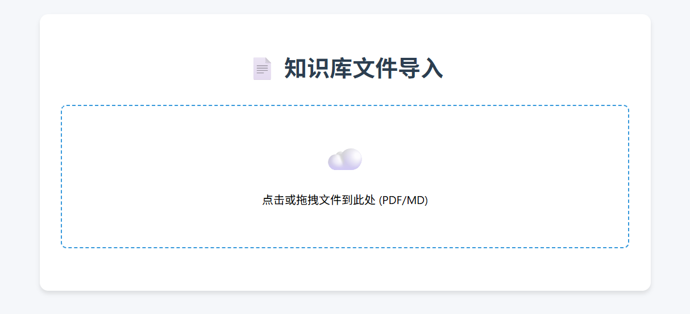
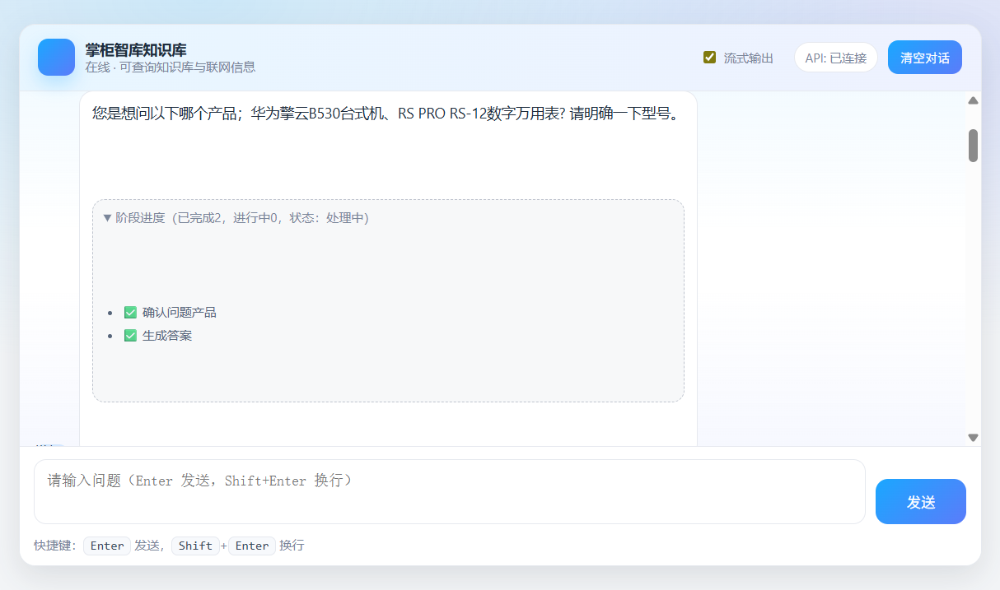
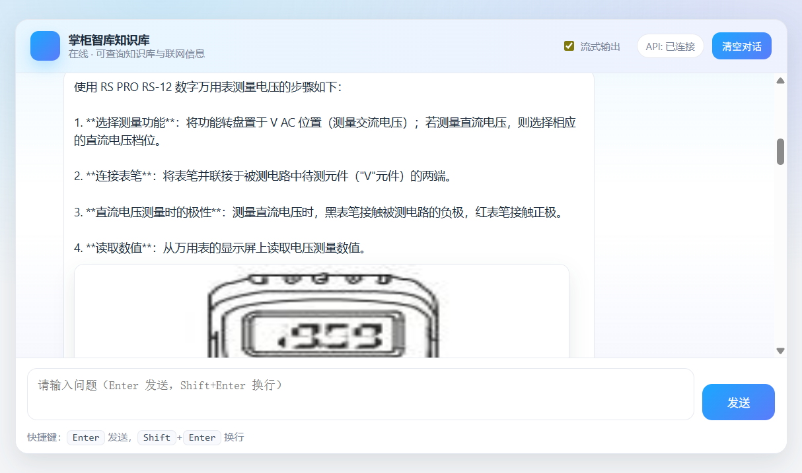
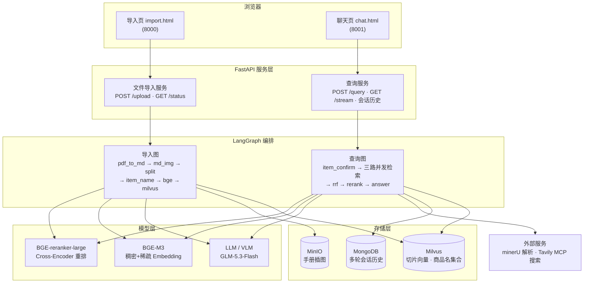
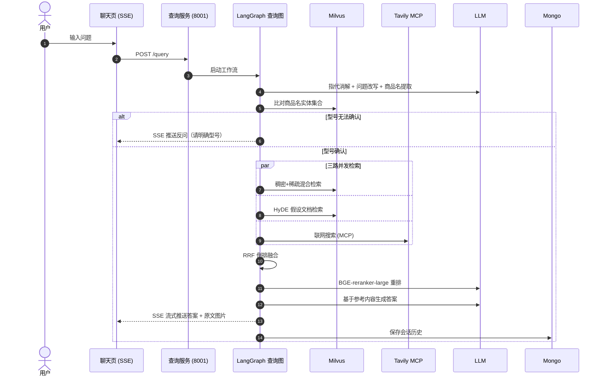
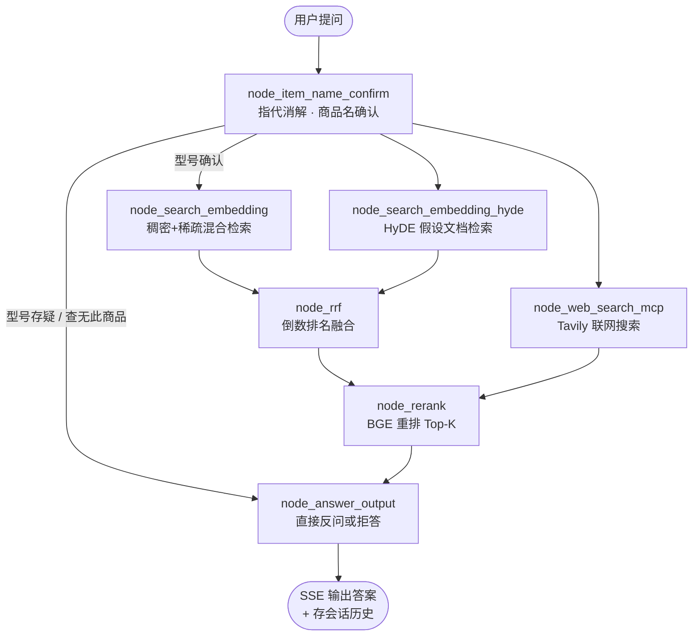
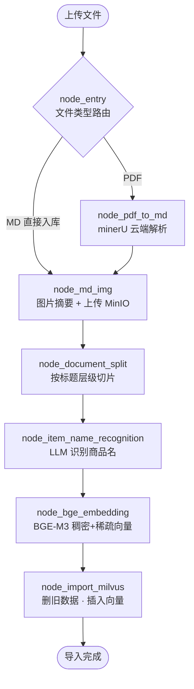

<div align="center">
  <h2>Knowledge_Base · 掌柜智库</h2>

  <p>
    
    
    
    
    
    
  </p>

  面向设备说明书的<strong>企业级 RAG 智能问答知识库</strong>。

  上传 PDF/MD 手册，自动解析入库；提问时经「商品名确认 → 三路混合检索 → RRF 融合 → 重排 → LLM 生成」链路，返回带原文图片的可溯源答案。
</div>

## 项目预览

**文件导入服务（PDF/MD 上传）**



**商品名确认：检索前先反问澄清型号，避免跨产品串答**



**最终答案：结构化步骤 + 原文图片，答案可溯源**



用户在导入页上传设备手册后，系统自动完成解析、切片与向量化入库；在聊天页提问时，SSE 实时推送「确认问题产品 → 切片搜索 → 网络搜索 → 切片搜索(假设性文档) → 倒排融合 → 重排序 → 生成答案」各阶段进度，最终答案附带从原文提取并托管在 MinIO 中的参考图片。

## 核心功能

### 文档导入流水线

- PDF 经 minerU 云端解析为 Markdown，图片自动提取并生成摘要标题。
- 图片上传 MinIO 并替换为公网 URL，答案中可直接回显原文插图。
- 按标题层级切片，BGE-M3 生成稠密 + 稀疏双向量写入 Milvus。
- LLM 识别「品牌 + 型号 + 名称」完整商品名，登记到 Milvus 商品名实体集合。

### 智能问答与商品名确认

- 提问先经 LLM 做历史指代消解与问题改写，再与商品名实体集合比对确认型号。
- 无法确认型号时自动反问用户澄清，查无此商品时直接拒答，避免跨产品串答。
- 支持多轮对话，MongoDB 持久化会话历史。

### 三路混合检索与重排

- 稠密向量 + 稀疏向量（BGE-M3）与 HyDE 假设性文档检索并行。
- 通过 MCP 协议调用 Tavily 联网搜索，补充库外知识。
- RRF 倒数排名融合三路结果，BGE-reranker-large 重排取 Top-K。

### 可观测与工程化

- SSE 流式推送每个 LangGraph 节点的执行进度与最终答案。
- loguru 双输出日志，`@node_log` / `@step_log` 装饰器记录节点与步骤耗时。
- 导入任务状态轮询接口，支持多文件上传与任务追踪。

## 架构设计



## 系统流程



## 核心工作流程

### 查询图（Query Graph）



### 导入图（Import Graph）



## 技术栈

| 层次 | 技术 | 用途 |
| :--- | :--- | :--- |
| Web 服务 | Python、FastAPI、Uvicorn、SSE | 双服务 HTTP API 与流式推送 |
| Agent 编排 | LangGraph、LangChain、openai-agents | 查询/导入双图编排与 MCP 调用 |
| LLM | GLM-5.3-Flash（OpenAI 兼容接口） | 指代消解、商品名识别、答案生成 |
| Embedding | BGE-M3（本地 GPU） | 稠密 + 稀疏双向量 |
| 重排 | BGE-reranker-large（本地 GPU） | Cross-Encoder 精排 |
| 文档解析 | minerU（magic-pdf） | PDF → Markdown 云端解析 |
| 向量库 | Milvus 2.6 | 切片向量混合检索、商品名实体集合 |
| 对象存储 | MinIO | 手册插图托管与公网访问 |
| 会话存储 | MongoDB | 多轮对话历史持久化 |
| 包管理 | uv | 依赖锁定与虚拟环境（Python 3.13） |

## 本地运行

### 环境要求

- Python **3.13**（`requires-python = ">=3.13,<3.14"`，本地 torch cu128 wheel 仅提供 cp313 标签）
- [uv](https://docs.astral.sh/uv/) 包管理器
- Docker（用于中间件）
- NVIDIA GPU（BGE-M3 与 Reranker 默认 `cuda:0`，可在 `.env` 改为 `cpu`）
- LLM API Key（OpenAI 兼容接口，如智谱 / DeepSeek）

### 1. 准备 torch 本地 wheel（重要）

`pyproject.toml` 通过 `[tool.uv.sources]` 引用 `_wheels/` 下的本地 wheel，该目录已被 git 忽略，**新机器 clone 后必须先手动放入，否则 `uv sync` 失败**：

```bash
mkdir _wheels
# 从镜像下载 cu128 cp313 三件套（示例：上交镜像；官方源国内直连较慢）
curl -L -C - -o _wheels/torch-2.11.0+cu128-cp313-cp313-win_amd64.whl ^
  https://mirror.sjtu.edu.cn/pytorch-wheels/cu128/torch-2.11.0%2Bcu128-cp313-cp313-win_amd64.whl
# 同理下载 torchvision、torchaudio 对应 wheel
```

> 若无需 GPU 或在 Linux 上运行，可改回 `pyproject.toml` 的官方 cu128 index，并放宽 `requires-python`。

### 2. 安装依赖

```bash
uv sync
```

### 3. 启动中间件

docker-compose 目前仅包含 MinIO，Milvus 与 MongoDB 需自行启动（示例）：

```bash
docker compose up -d                    # MinIO (9000 API / 9001 控制台)

docker run -d --name mongo -p 27017:27017 mongo

docker run -d --name milvus-standalone \
  -p 19530:19530 -p 9091:9091 milvusdb/milvus:v2.6.7 \
  # 生产建议使用官方 standalone 编排脚本（含 etcd/minio）
```

### 4. 配置 .env

复制模板并填入实际值：

```bash
cp .env.example .env
```

关键变量说明：

```ini
# LLM（OpenAI 兼容）
OPENAI_API_KEY=your-api-key
OPENAI_BASE_URL=https://open.bigmodel.cn/api/paas/v4
LLM_DEFAULT_MODEL=GLM-5.3-Flash
VL_MODEL=GLM-5.3-Flash

# 本地模型路径（注意完整到 \BAAI 一层）
BGE_M3_PATH=D:\ai_models\BAAI\bge-m3
BGE_DEVICE=cuda:0
BGE_RERANKER_LARGE=D:\ai_models\BAAI\bge-reranker-large
BGE_RERANKER_DEVICE=cuda:0

# 中间件（Windows 下务必用 127.0.0.1 而非 localhost，避免 IPv6 解析问题）
MILVUS_URL=http://127.0.0.1:19530
CHUNKS_COLLECTION=kb_chunks
ITEM_NAME_COLLECTION=kb_item_names
MONGO_URL=mongodb://127.0.0.1:27017
MONGO_DB_NAME=kb002
MINIO_ENDPOINT=127.0.0.1:9000
MINIO_ACCESS_KEY=minioadmin
MINIO_SECRET_KEY=minioadmin
MINIO_BUCKET_NAME=knowledge-base-files

# 文档解析与联网搜索
MINERU_API_TOKEN=your-mineru-token
MINERU_BASE_URL=https://mineru.net/api/v4
MCP_WEB_SEARCH_URL=your-tavily-mcp-url

# 日志
LOG_CONSOLE_ENABLE=True
LOG_FILE_ENABLE=True
LOG_FILE_RETENTION=7 days
```

### 5. 下载本地模型

BGE-M3 与 Reranker 首次运行可从 ModelScope 下载，或手动放置：

```bash
uv run app\tool\download_bgem3.py
uv run app\tool\download_reranker.py
```

### 6. 启动服务

```bash
uv run app\import_process\api\file_import_service.py   # 导入服务 :8000
uv run app\query_process\api\query_service.py          # 查询服务 :8001
```

### 7. 访问

- 导入页：<http://127.0.0.1:8000/import.html> — 上传 PDF/MD 手册
- 聊天页：<http://127.0.0.1:8001/chat.html> — 输入问题开始问答

## 目录结构

```text
Knowledge_Base
├── app/
│   ├── import_process/          # 导入服务 (:8000)
│   │   ├── api/file_import_service.py   # FastAPI 入口
│   │   ├── agent/               # 导入 LangGraph（7 节点）
│   │   └── page/import.html     # 上传前端页
│   ├── query_process/           # 查询服务 (:8001)
│   │   ├── api/query_service.py # FastAPI 入口
│   │   ├── agent/               # 查询 LangGraph（7 节点）
│   │   └── page/chat.html       # 聊天前端页
│   ├── clients/                 # Milvus / MinIO / MongoDB / Neo4j 客户端
│   ├── conf/                    # dataclass 配置层（读 .env）
│   ├── core/                    # loguru 日志、Prompt 加载、节点计时装饰器
│   ├── lm/                      # BGE-M3 / Reranker / LLM 封装
│   ├── tool/                    # 本地模型下载脚本
│   └── utils/                   # SSE / 任务状态 / 限流等工具
├── prompts/                     # 答案生成、HyDE、商品名识别等 Prompt 模板
├── sse/                         # SSE 渐进式教学示例（step1~5，非生产代码）
├── doc/                         # 测试语料库（70+ 设备手册 PDF）
├── assets/images/               # README 截图
├── docker-compose.yml           # MinIO 中间件
├── .env.example                 # 环境变量配置模板
├── pyproject.toml               # uv 依赖配置（torch 走本地 wheel）
└── uv.lock                      # 锁定依赖版本
```

## 已知注意事项

- **torch 本地 wheel**：`_wheels/` 被 pyproject 引用但被 git 忽略，clone 后必须自行补齐（见本地运行第 1 步）。
- **Windows 中间件地址**：`localhost` 会解析到 IPv6 `::1`，容器端口映射走 IPv4，`.env` 中请使用 `127.0.0.1`。
- **环境变量覆盖**：`load_dotenv()` 默认不覆盖进程内已存在的环境变量，改 `.env` 后如仍生效旧值，需清理当前终端的残留变量。
- **BGE 模型路径**：本地路径需完整到 `\BAAI\bge-m3` 一层，否则 transformers 会把含 `\` 的路径误判为 HuggingFace repo id。
- **Python 版本上限**：`<3.14` 是因为 cu128 wheel 仅 cp313 标签；跨版本会解析出不同依赖组合。

## License

未声明开源协议，仅供学习交流使用。
