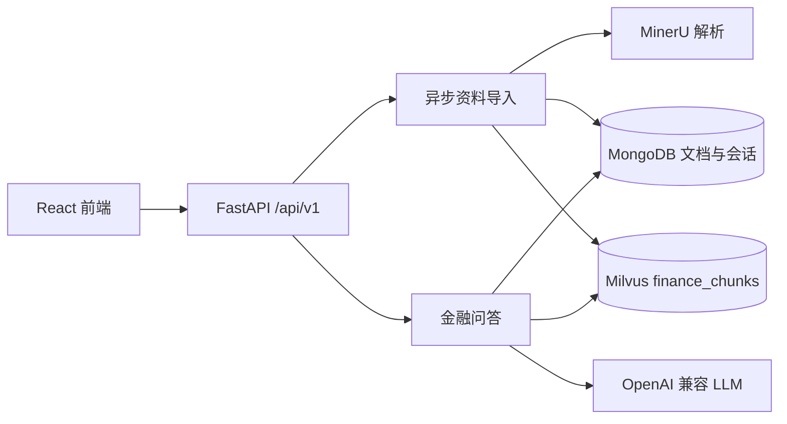

# 掌柜智库 · 金融知识库

面向普通用户的金融资料查询与理解工具。它只依据已导入的基金产品资料、理财风险揭示书、公司报告、宏观政策和投资者教育材料回答问题，并为每个答案返回可核对的资料引用。

系统不提供个性化投资建议、不承诺收益；涉及产品、风险和收益时，以正式产品文件、公告原文和监管文件为准。

## 功能

- 导入 PDF、DOC、DOCX、Markdown。非 Markdown 文件通过 MinerU 解析，保存 Markdown、页码、表格与附注位置。
- 文档、版本、实体、导入任务、会话和消息使用独立的 `finance_` MongoDB 集合保存。
- 向量数据写入独立的 `finance_chunks` Milvus 集合，旧设备资料不会参与金融检索。
- 支持金融资料检索、流式问答、会话历史、引用来源预览、资料停用与失败任务重试。
- 提供 OpenAPI 3 文档：每个接口具备稳定 `operationId`、请求/响应模型和错误响应说明。

## 架构



## 本地启动

1. 启动 MongoDB、Milvus 和 MinIO。现有 `docker-compose.yml` 用于 MinIO；MongoDB 和 Milvus 可沿用你已有的本地服务。
2. 从 `.env.example` 复制出 `.env`，填写模型、MinerU 和中间件配置，并增加以下金融版变量：

```ini
FINANCE_MONGO_DB_NAME=finance_knowledge_base
FINANCE_CHUNKS_COLLECTION=finance_chunks
FINANCE_WORK_DIR=output/finance
FINANCE_MINIO_BUCKET=finance-knowledge-base
```

3. 启动金融 API：

```powershell
uv run uvicorn app.main:app --host 127.0.0.1 --port 8002
```

4. 启动独立前端：

```powershell
cd frontend
npm install
npm run dev
```

打开 `http://127.0.0.1:5173`；API 文档位于 `http://127.0.0.1:8002/docs`，原始 OpenAPI 文档位于 `http://127.0.0.1:8002/openapi.json`。

## API 概览

| 接口组 | 用途 |
| --- | --- |
| `/api/v1/documents` | 上传、读取、修正元数据、停用和下载资料 |
| `/api/v1/import-tasks` | 查询或重试异步导入任务 |
| `/api/v1/sessions` | 创建、列出会话和读取历史消息 |
| `/api/v1/queries` | 创建查询、读取结果、订阅 SSE 事件流 |
| `/api/v1/health` | 查看 MongoDB、Milvus、MinIO 的就绪状态 |

## 数据与回答边界

- 文件名和目录仅作为辅助信息。资料类型、主体、日期和代码应由正文识别，缺失值保持为空。
- 基金产品与基金份额、产品代码与机构角色分别建模；代码以字符串保存，保留前导零。
- 资料更新使用版本模型；新版本完成解析和向量化后才成为活动版本。
- 询问“最新”时，系统只说明知识库中可确认的最新资料，并显示资料日期。
- 没有充分证据时，系统明确说明未检索到足够信息，不编造费率、风险等级、财务数据或引用来源。

## 验收资料

金融资料盘点、固定验收题和演示路径位于 `doc/finance/`。其中固定验收集只用于发布验证；调整检索或提示词时应使用独立的开发题集，避免只对验收题调参。
